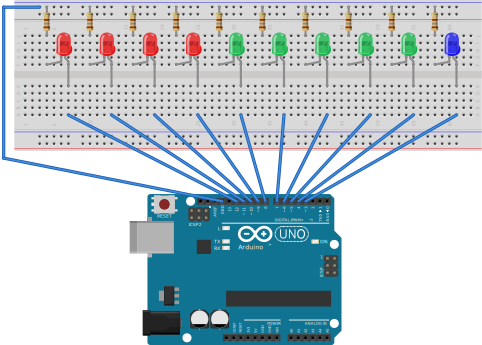
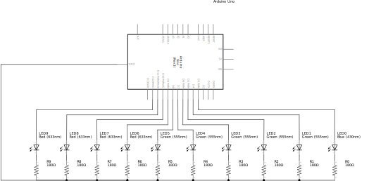

# Simple Arduino Pomodoro

**Already working, but still under development.**

The goal of this project is to build a fully functioning Pomodoro timer with a microcontroller and only a few additional components (LEDs, resistors, etc.).
It's aimed at beginners who are interested in electronics and programming with Arduinos.
There are two independent steps:

- Step 1 (Easy): Build the entire circuit on a solderless breadboard to see how it works.
- Step 2 (Intermediate): Transfer the circuit to a prototype PCB. This is is a bit more complicated as it requires soldering and a few more components.

## What is the Pomodoro Technique?

The Pomodoro Technique is time management method.
It can help to avoid procrastination by breaking down work into intervals of intense focus, separated by short breaks.

There are six steps in the original technique:

1. Decide on the task to be done.
2. Set the pomodoro timer (traditionally to 25 minutes).
3. Work on the task.
4. End work when the timer rings and put a checkmark on a piece of paper.
5. If you have fewer than four checkmarks, take a short break (3–5 minutes), then go to step 2.
6. After four pomodoros, take a longer break (15–30 minutes), reset your checkmark count to zero, then go to step 1.

Explanation mostly copied from the <a href="https://en.wikipedia.org/wiki/Pomodoro_Technique" title="Pomodoro Technique" target="_blank">Wikipedia article</a>.

## Why does this project exists?

Well, mainly because I wanted to do a little electronics project again for a long time now.
Even though I work as a web developer today (after studying) I initially started out as an electrician technician.
So this is basically a "back to the roots" project for me :)

A Pomodoro timer is also something I consider to be useful for me (I tend to be easily distracted sometimes) and others - Win, win!

Oh, and yes: There are a lot of apps and websites out there that more or less do the same thing as this timer.
The issue I have with them is that they are often a gateway to unwanted procrastination.
Picking up your phone to see how much time is left?
"Let me just check my messages real quick."
Switching to the browser to see what the timer is saying?
"Okay, but how about some cat videos?"
Also: It's simply fun to build something instead of just downloading!

## Step 1 (Easy): Arduino Uno + Solderless Breadboard

This section shows how an Arduino Uno Board has to be connected to a few LEDs (and resistors) on a breadboard to work with this projects code.

### Requirements

- 1 Arduino Uno (+ USB cable)
- 1 Breadboard
- 11 Breadboard wires (Best: Male to Male jumpers)
- 10 LEDs (4x red, 5x green, 1x blue - But it doesn't really matter)
- 10 resistors 150 Ω

### Breadboard wiring

### Breadboard circuit diagram

## Step 2 (Intermediate): ATtiny2313 on a prototype PCB (+ Arduino Uno as programmer)

Coming soon.
